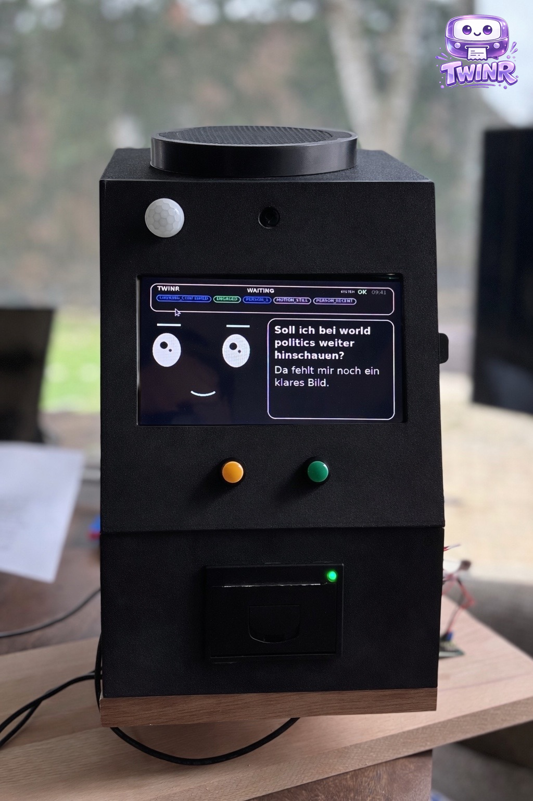
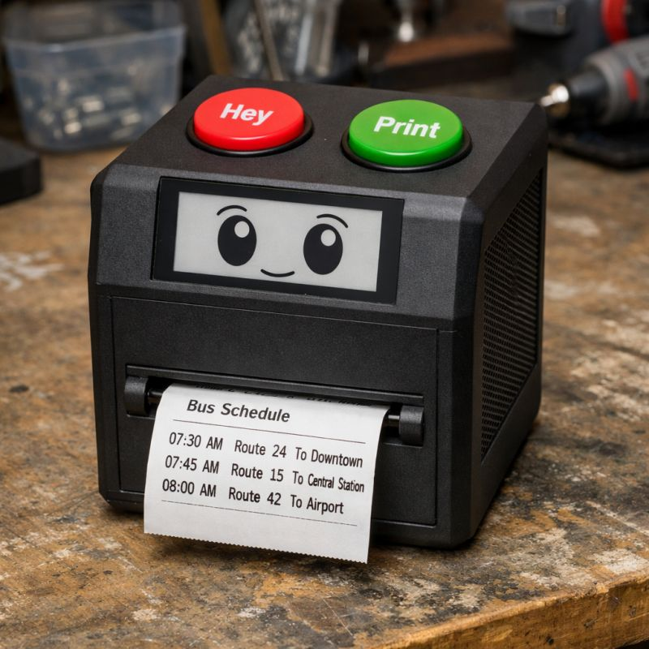

**WHAT**

*TWINR* is an AI Agent for senior citizens; fully open-source, aiming to make AI accessible to people who would really profit of it. 
*TWINR is heavy WIP, but already working if you do some tinkering. I would love to have new contributors*


(You can find the completely unedited picture here --> twinr-prototype.jpeg)

**WHY**

Due to a sad personal event, I spent the last two weeks 24/7 with my mother who is really not tech-savy at all. Okay, tbh - she does not know how to start a computer or use a smart phone - so the web, AI, everything we use daily in our bubble is out of reach to her. 
However: She has so many questions and small tasks an AI Agent could handle easily - plus she loves to use her Alexa, as it is controlled by voice and thus natural to communicate with… but, as we all know, it is limited in it’s capabilities.

**MISSION**

The goal is simple: *Make a voice controlled agent that is as non-digital, as haptic and as accessible as possible*.

**CONTRIBUTE**

So if you are a builder, UX person, maker… and want to join add me on LinkedIn or write to th@arculae.com … if you are not, but you think this is cool, *just share the repo*.


---

**CAPABILITIES**

Twinr is not just a voice wrapper. This repo spans embodied interaction, multimodal perception, memory, automations, integrations, self-programming, operator tooling, and Raspberry-Pi deployment.

- Embodied multi-modal interaction: voice, physical buttons, camera, motion sensing, paper output, display feedback, and optional body movement in one agent stack
- Transcript-first live voice pipeline with follow-up listening, spoken replies, and web-backed question answering
- Physical output layer with speech, thermal printer notes, animated HDMI face UI, and optional servo-based user-following
- Multimodal sensing built around Pi AI Camera, ReSpeaker XVF3800, PIR motion, VAD, and bounded event fusion
- Presence, attention, engagement, and cautious incident cues derived from sensor fusion instead of one-off single-signal hacks
- Proactive companion behaviors that can notice return, stillness, showing intent, or possible distress without defaulting to annoying chatter
- Visual understanding for “look at this” moments, gesture-aware interaction, and camera-assisted embodied UX
- Adaptive memory stack with rolling on-device context, explicit remembered facts, reminders, and optional long-term ChonkyDB memory
- Automation engine for scheduled routines, sensor-triggered actions, printed briefings, and LLM-generated recurring jobs
- Experimental self-programming / Adaptive Skill Engine for compiling reviewed, sandboxed new skills and automations
- Integration-ready architecture for email, calendar, messaging, smart home, and future external systems
- WhatsApp prototype channel plus a broader communications roadmap across TWINR-to-TWINR and TWINR-to-device links
- Caregiver and operator dashboard for devices, memory, automations, system health, logs, and personality management
- Raspberry-Pi hardware operations layer for display, audio, printer, camera, PIR, servo, deployment, and acceptance testing
- Open-source prototype-body 3D-print files and state sound assets included directly in the repo for fast physical iteration

**ROADMAP**

- TWINR App Store with voice discovery and voice-guided installation of reviewed skills
- Real-time TWINR-to-TWINR and TWINR-to-device audio/video communication
- Android and iPhone companion app for family members, caregivers, and operators
- Integration with health trackers and connected health devices
- Proactive companion mode that stays supportive without becoming intrusive or annoying
- Integrated autonomous indoor drone based on Crazyflie for wellbeing checks and other supportive tasks

---



*This is how I imagine TWINR to look in the second or third iteration*

**PROTOTYPE ASSETS**

This repo already includes a few practical prototype assets:

- `3dprint/` contains simple prototype-body parts as `.stl` and `.scad` files, including `main_panel`, `top_panel`, `respeaker`, and `thermal_printer`
- `media/` contains basic state sounds such as `boot.mp3` and `waiting.mp3`

**SHOPPING LIST**


*TWINR Hardware (current prototype direction)*

*Core compute and sensing*

1 x Raspberry Pi 4 or newer

1 x microSD card or SSD for OS, runtime state, and artifacts

1 x Raspberry Pi AI Camera (IMX500) for person, gesture, and presence-related vision

1 x PIR motion sensor with 3.3V-safe GPIO output

2 x buttons (I used 12mm SPST-NO from Same-Sky)

*Audio and feedback*

1 x ReSpeaker XVF3800 4-Mic Array as the main microphone/audio front-end

1 x small speaker compatible with your chosen ReSpeaker playback path

1 x 4" HDMI mini-screen for Twinr's animated face and status UI

1 x thermal printer (DFRobot DFR0503-EN / GP-58-compatible path)

1 x dedicated 9-24V / 2.5A power supply for the thermal printer

*Optional body movement*

1 x digital servo for body rotation; my prototype uses a 360-degree 20 kg model

1 x servo controller / driver, preferably a Pololu Mini Maestro

*Power and build extras*

Optional: a DC-DC converter / buck converter for cleaner power distribution inside the body

Optional: a separate helper Pi if you want to offload the AI-camera or servo path

Plenty of jumper wires, Dupont leads, USB cables, power leads, cable clamps / terminals, and general mounting hardware

Optional: 3D-printed body parts from `3dprint/`

The repo still contains an older Waveshare 4.2" e-paper path for a more minimal build, but the richer current prototype direction is centered on HDMI, Pi AI Camera, ReSpeaker audio, and optional body rotation.

---


**POWER & SAFETY**

For the richer HDMI + camera + audio + printer build, clean power and careful wiring matter a lot more than in the earliest minimal prototype.

- Power the Raspberry Pi through its normal USB-C input with a stable `5V / 3A+` supply
- Give the thermal printer its own `9-24V` supply; do not try to run it from Pi GPIO or weak USB power
- Give a large body servo its own supply matched to the servo vendor spec; do not power a `20kg` servo from the Pi
- If you distribute power inside the body from one larger source, use proper regulators / buck converters for the separate rails instead of improvised direct taps
- Never feed more than `3.3V` into Raspberry Pi GPIO pins
- Share ground where control signals need a common reference, for example Pi and PIR, or Pi / Maestro / servo supply
- Disconnect power before rewiring, double-check polarity before first boot, and secure cables so movement does not pull on GPIO or CSI connectors
- Treat brownouts, random reboots, printer glitches, and twitching servos as likely power-distribution problems first

**HOW TO WIRE**

The current prototype direction is centered on a Raspberry Pi, HDMI mini-screen, ReSpeaker XVF3800 audio, Raspberry Pi AI Camera, two buttons, PIR motion sensing, a thermal printer, and an optional body-rotation servo. The older e-paper path still exists in the repo, but it is no longer the best default for the richer embodied prototype.

See also: [docs/WIRING_DIAGRAM.md](./docs/WIRING_DIAGRAM.md) for a compact Markdown diagram of the current wiring layout.

*1. Prepare the Raspberry Pi*

Install Raspberry Pi OS first. A microSD card is the easiest starting point, though SSD boot also works on recent Pi setups. Before mounting everything into the body, do at least one bench boot with network, keyboard, and screen attached so you can confirm the base system is healthy.

*2. Connect the HDMI mini-screen*

Connect the display to one of the Pi's HDMI outputs with the cable or adapter your screen requires. Many small HDMI screens also need separate `5V` power over USB; if yours does, power it from a suitable regulated `5V` line rather than assuming HDMI alone is enough. Mount the screen so it is readable head-on and leave enough slack in the HDMI cable that opening the body later does not stress the port.

*3. Connect the Raspberry Pi AI Camera*

Connect the Pi AI Camera to the Pi's CSI camera connector with the correct ribbon cable orientation and lock the connector before powering up. Do not hot-plug the camera ribbon. Mount the camera facing forward with a stable field of view, because Twinr uses this path for person, gesture, attention, and presence-related cues.

*4. Connect the ReSpeaker XVF3800 and speaker*

Connect the ReSpeaker XVF3800 to the Pi through its supported USB path so Twinr can use it as the main microphone/audio front-end. Then connect a compatible speaker or powered speaker path for playback. The exact speaker wiring depends on your ReSpeaker board variant: some setups want a powered speaker or small amplifier stage, so do not assume the board can safely drive an arbitrary passive speaker directly. If you prefer, Twinr can also keep ReSpeaker as the microphone path while using a different playback sink such as HDMI audio.

*5. Connect the two buttons*

Use the buttons as simple GPIO inputs with the Pi's internal pull-ups.

Current Twinr mapping:

- Green / "Hey" button: one side to `GPIO23` (`physical pin 16`)
- Yellow / "Print" button: one side to `GPIO22` (`physical pin 15`)
- The other side of both buttons goes to `GND`

No external resistor is required when the software uses the normal pull-up configuration. Do not connect these button inputs to `5V`.

*6. Connect the PIR motion sensor*

Current Twinr prototype mapping:

- `OUT -> GPIO26` (`physical pin 37`)
- `GND -> GND`
- `VCC ->` the supply voltage required by your PIR module

Software defaults assume `active_high=true` and `bias=pull-down`. The signal presented to the Raspberry Pi must stay at or below `3.3V`. If your PIR module is not explicitly GPIO-safe, add level shifting before connecting it to the Pi.

*7. Connect the thermal printer*

For the current printer path, connect the DFRobot `DFR0503-EN` to the Pi over USB and power it from its own external `9-24V / 2.5A` supply. Keep printer power physically separate from the Pi's GPIO power pins. USB carries the data path; the external supply handles the real heating and paper feed load.

*8. Optional: connect the body-rotation servo*

There are two practical paths:

- Preferred path: use a `Pololu Mini Maestro` as the servo controller. Connect the Maestro to the Pi over USB, switch it into `USB_DUAL_PORT`, then connect the servo to the Maestro rather than directly to the Pi. Power the servo from its own supply matched to the servo's requirements.
- Simpler direct path: connect servo `SIG -> GPIO18` (`physical pin 12`), `GND -> GND`, and `V+ ->` the servo supply recommended by the vendor. This is workable for direct experiments, but the calmer hardware path is usually the external controller.

If you use an external servo supply, keep a common ground between the control side and the servo side. For continuous-rotation or high-torque servos, bench-test motion before mounting the mechanism into the body.

*9. First bring-up and configuration*

After wiring, configure and smoke-test each subsystem separately before closing the body:

```bash
cd /twinr
sudo hardware/display/setup_display.sh --env-file /twinr/.env --driver hdmi_wayland
sudo hardware/mic/setup_audio.sh --env-file /twinr/.env --test
sudo hardware/mic/setup_respeaker_access.sh
hardware/buttons/setup_buttons.sh --green 23 --yellow 22
hardware/pir/setup_pir.sh --motion 26 --probe
sudo hardware/printer/setup_printer.sh --default --test
python3 hardware/piaicam/smoke_piaicam.py
sudo hardware/servo/setup_pololu_maestro.sh
```

That staged approach is worth the time. It makes it much easier to catch a bad GPIO mapping, weak power rail, loose camera ribbon, muted audio path, or wrong printer polarity before everything is buried inside the enclosure.

