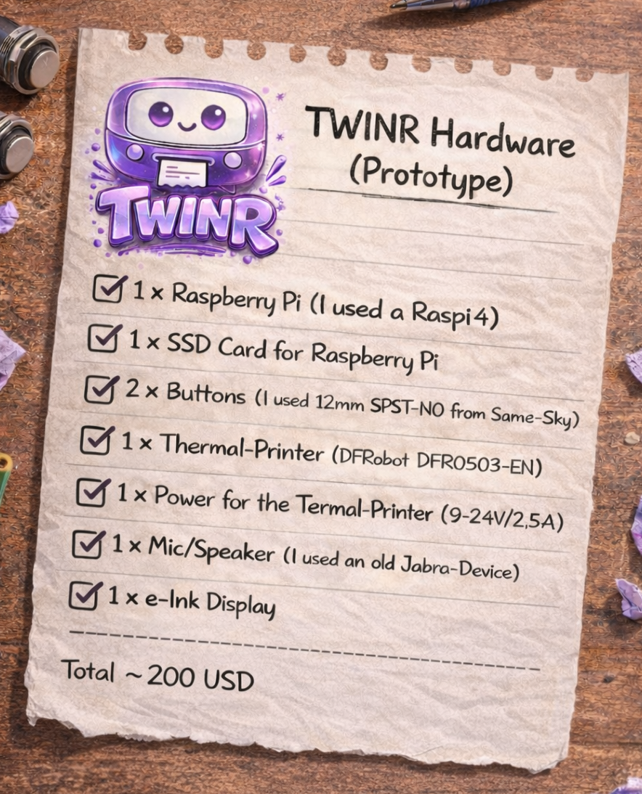

**WHAT**

*TWINR* is an AI Agent for senior citizens; fully open-source, aiming to make AI accessible to people who would really profit of it.

**WHY**

I spent the last two weeks 24/7 with my mother who is really not tech-savy at all. Okay, tbh - she does not know how to start a computer or use a smart phone - so the web, AI, everything we use daily in our bubble is out of reach to her. 
However: She has so many questions and small tasks an AI Agent could handle easily - plus she loves to use her Alexa, as it is controlled by voice and thus natural to communicate with… but, as we all know, it is limited in it’s capabilities.

**MISSION**

The goal is simple: *Make a voice controlled agent that is as non-digital, as haptic and as accessible as possible*.

**CONTRIBUTE**

So if you are a builder, UX person, maker… and want to join add me on LinkedIn or write to th@arculae.com … if you are not, but you think this is cool, *just share the repo*.

---


*This is how I imagine TWINR to look in the second or third iteration*

---

**SHOPPING LIST**



*TWINR Hardware (Prototype)*

1 x Raspberry Pi (I used a Raspi4)

1 x SSD Card for Raspberry Pi

2 x Buttons (I used 12mm SPST-NO from Same-Sky)

1 x PIR motion sensor with 3.3V-safe GPIO output

1 x Thermal-Printer (DFRobot DFR0503-EN)

1 x Power for the Termal-Printer (9-24V/2,5A)

1 x Mic/Speaker (I used a old Jabra-Device)

1 x e-Ink Display (I used Waveshare 4.2 Inch)

*Total ~200 USD*

---


**HOW TO WIRE**

Assumptions: Raspberry Pi 4, DFRobot DFR0503-EN thermal printer, a Waveshare 4.2-inch e-Paper module, two SPST-NO push buttons, and an older Jabra USB audio device. Raspberry Pi 4 has a 40-pin GPIO header, USB ports, USB-C power, and typically boots from microSD, though recent Pi models can also boot from USB storage.

*1. Prepare the Raspberry Pi*

Install Raspberry Pi OS on a microSD card first. That is the simplest boot medium for a prototype. On recent Pi models, USB storage also works, but microSD is the standard starting point.

*2. Power layout*

Use two separate power paths:

Raspberry Pi 4: power it through its USB-C power input

Thermal printer: power it through its own printer power port

Do not try to power the printer from the Pi’s GPIO pins or from the Pi’s USB power alone

The DFRobot printer is specified for 9–24 V and about 0.5–2.5 A, with instantaneous current up to 2.5 A, so it needs its own external supply. The Pi 4 itself uses 5 V / 3 A over USB-C.

*3. Connect the thermal printer*

For the simplest prototype setup, use the printer over USB, not TTL serial.

Connect the printer’s USB data cable to a free USB port on the Raspberry Pi

Connect the printer’s power connector to the external 9–24 V / 2.5 A power supply

Follow the + / - markings on the printer connector or harness for polarity

Do not connect printer power to the Pi GPIO header

DFRobot states that the printer supports USB and TTL communication, has a dedicated power port, and is compatible with Raspberry Pi.

*4. Connect the Jabra microphone/speaker*

Connect the Jabra device by USB to a free USB port on the Raspberry Pi. In this setup, the single USB connection carries both audio input and audio output. Raspberry Pi supports audio over USB, and Jabra notes that on Linux their USB devices generally work at the audio level, while more advanced call-control features depend on the exact model and software.

*5. Connect the Waveshare 4.2" e-Paper display*

The Waveshare module uses SPI. Some versions can plug directly onto the Pi’s 40-pin header. If yours uses the 8-pin cable, wire it like this:

VCC → 3.3 V on the Pi

GND → GND on the Pi

DIN / MOSI → physical pin 19 (GPIO10 / SPI0 MOSI)

CLK / SCLK → physical pin 23 (GPIO11 / SPI0 SCLK)

CS / CE0 → physical pin 24 (GPIO8 / SPI0 CE0)

DC → physical pin 22 (GPIO25)

RST → physical pin 11 (GPIO17)

BUSY → physical pin 18 (GPIO24)

Waveshare documents the Pi connection through the 40-pin header and gives this SPI mapping; Raspberry Pi documents SPI0 as MOSI on GPIO10, SCLK on GPIO11, and CE0 on GPIO8. Raspberry Pi GPIO works at 3.3 V, and inputs must not exceed 3.3 V.

*6. Connect the two buttons*

Use the buttons as simple GPIO inputs with the Pi’s internal pull-up resistors. That is the cleanest wiring for SPST-NO buttons.

Current Twinr mapping:

“Hey” button: one side to GPIO23 (physical pin 16)

“Print” button: one side to GPIO22 (physical pin 15)

The other side of both buttons goes to GND

No external resistor is required for this setup if your software uses the normal pull-up configuration. In gpiozero, the Button class defaults to pull_up=True, which means one side of the button goes to ground and the other to a GPIO pin. Ground pins on the Pi are electrically common, so any convenient GND pin is fine. Never connect a button input to 5 V; Pi GPIO inputs must stay at 3.3 V max.

*7. Connect the PIR motion sensor*

Twinr now has a dedicated PIR motion input.

Current Twinr mapping:

PIR `OUT` -> GPIO26 (physical pin 37)

PIR `GND` -> GND

PIR `VCC` -> the supply voltage expected by your PIR module

Software defaults assume:

- `active_high=true`
- `bias=pull-down`

Important guardrail: the signal arriving at the Raspberry Pi GPIO input must never exceed `3.3V`. Many PIR breakout boards work safely, but do not assume that blindly. If your module is not explicitly GPIO-safe, add level shifting before wiring `OUT` to the Pi.

Some breakout boards or notes label this line as `IO26`. In Twinr that means BCM `GPIO26`.

Current Twinr config variables for the PIR path:

- `TWINR_PIR_MOTION_GPIO`
- `TWINR_PIR_ACTIVE_HIGH`
- `TWINR_PIR_BIAS`
- `TWINR_PIR_DEBOUNCE_MS`

Useful local commands:

```bash
cd /twinr
hardware/pir/setup_pir.sh --motion 26 --probe
./.venv/bin/python hardware/pir/probe_pir.py --env-file /twinr/.env --duration 30
```
